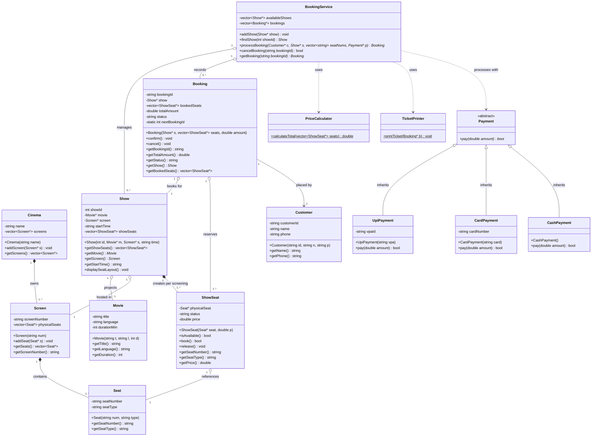
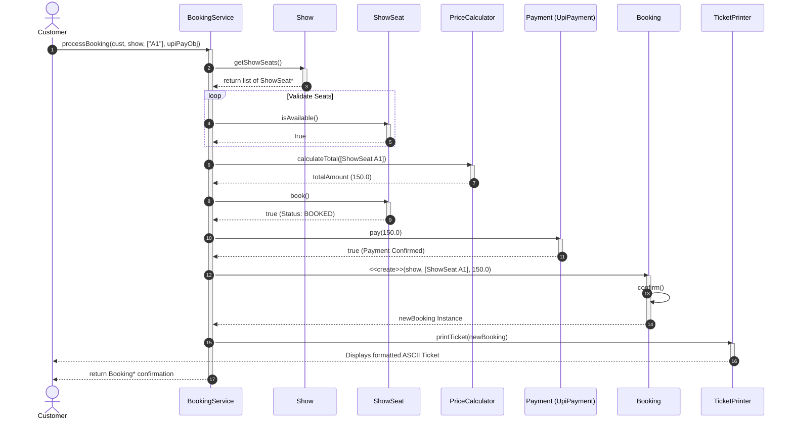

# Movie Ticket Booking System (TCS-504)

A modular, console-based cinema ticket booking engine implemented in C++ adhering strictly to Object-Oriented Programming (OOP) and SOLID design principles.

---

## 1. Class Diagram



---

## 2. Sequence Diagram (Booking & UPI Payment)



---

## 3. SOLID Principles Application

1. **Single Responsibility Principle (SRP):** `Booking` manages booking state; ticket formatting is handled by `TicketPrinter`, and tier calculations are isolated in `PriceCalculator`.
2. **Open/Closed Principle (OCP):** Adding new payment methods requires a new subclass of `Payment` without modifying existing booking workflows[cite: 1].
3. **Dependency Inversion Principle (DIP):** High-level `BookingService` depends on the abstract `Payment` contract rather than concrete payment types[cite: 1].

---

## 4. Compilation & Execution

```bash
# Compile
g++ -std=c++11 main.cpp -o cinema_app

# Run
./cinema_app
```
